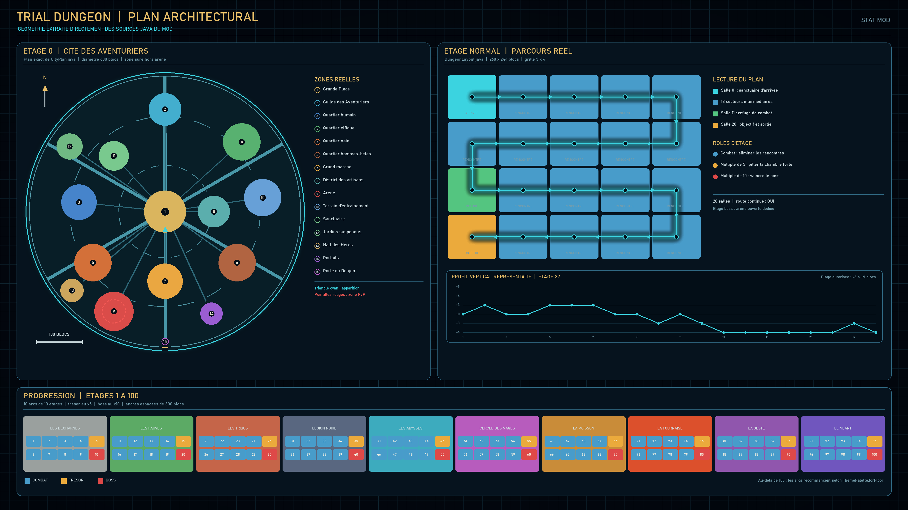
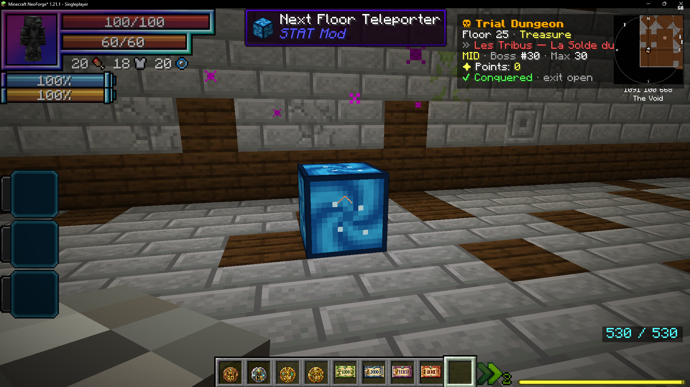
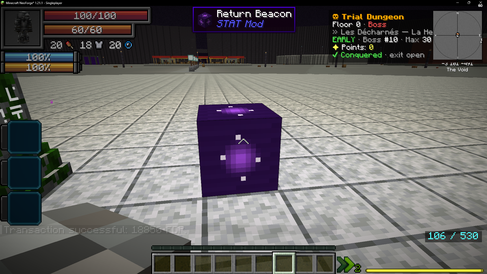
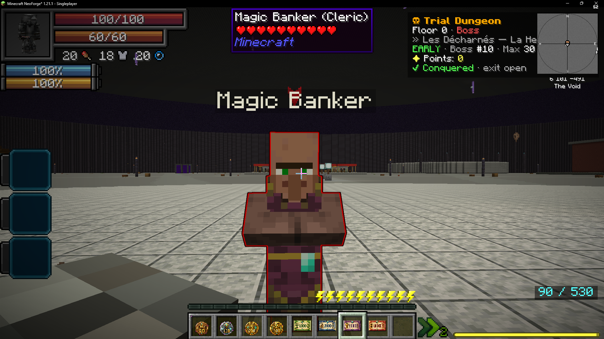

# Trial Dungeon

Dimension dédiée (`statmod:trial_dungeon`) : un donjon **procédural infini** en étages,
où chaque étage doit être **conquis** pour débloquer le suivant.

Ce plan est généré directement depuis les constantes et règles Java du donjon. Il
représente la géométrie exacte de la Cité des Aventuriers, le parcours des 20 salles
d'un étage normal et la cadence réelle des étages 1 à 100. Le profil vertical montré
est celui de l'étage 37 ; les hauteurs restent déterministes mais varient selon l'étage.

## Entrer et sortir

- **Portail du donjon** (`dungeon_portal`) : clic droit → téléportation au plus haut étage atteint
- **Balise de poche** (`dungeon_beacon`, craftable) : entre dans le donjon depuis n'importe où ; depuis le donjon → retour overworld
- **Balise de retour** sur chaque étage → retour overworld
- **Téléporteur d'étage suivant** : apparaît après la conquête et mène à l'étage débloqué
- La mort dans le donjon est **annulée** : inventaire et XP préservés, soin complet, retour à l'étage 1

## Les étages

| Type | Fréquence | Objectif de conquête |
|---|---|---|
| Combat | par défaut | ⚔ Éliminer toute la vague |
| Trésor | étages ×5 | ✦ Ouvrir le coffre du vault |
| Boss | étages ×10 | ☠ Vaincre le boss de l'autel |

- **100 thèmes** répartis en 10 arcs (pierre, os, glace, nether, améthyste…), difficulté croissante, boucle au-delà de 100
- Étages de combat : forteresse en chaîne de pièces avec pièges, mezzanines, salles secrètes
- Les rencontres sont activées **salle par salle** ; nettoyer une salle ouvre la progression,
  et l'étage n'est conquis qu'après tous les secteurs obligatoires
- Étages de boss : arène géante à ciel ouvert, boss du roster (40+ : SLU, Iron's Spellbooks, vanilla) invoqué à l'autel
- Chambres-fortes **ultra-secrètes** (~1 étage de combat sur 7) : sanctuaire caché → arme relique unique

## Étage 0 — Cité des Aventuriers

L'étage 0 est un hub permanent sans monstres : quartiers humain, elfe, nain et hommes-bêtes,
grand marché, guilde, artisans, portails, sanctuaire et intérieurs visitables.

- PvP désactivé dans toute la cité, sauf dans l'arène
- Arène de duel protégée avec porte, barrière intérieure et tribunes
- Duels joueur contre joueur et affrontements par équipes
- Terrains d'entraînement séparés pour guerriers, archers et mages
- Vrais mannequins d'entraînement issus du modpack et marchand de flèches côté archer

## Mobs & mages

- Rencontres progressives par salle, mobs de 10+ mods selon le thème
- **Escouades de mages** dès l'étage 3 (Pyromancien, Cryomancien, Électromancien, Clerc, Mage du Wither dès l'étage 15) escortées d'un chevalier et d'un archer
- Les mages **incantent** (son + particules) : les frapper pendant l'incantation **interrompt le sort**
- Priorité tactique : éliminez le Clerc (soigneur) en premier !

### Vie des monstres

| Profondeur | Multiplicateur de vie de base |
|---|---:|
| Étage 1 | ×3 |
| Étage 10 | ×4 |
| Étage 25 | ×6 |
| Étage 50 | ×9 |
| Étage 75 | ×12 |
| Étage 100 | ×15 |
| Abysses | jusqu'à ×25 |

Les élites reçoivent ensuite un multiplicateur supplémentaire de ×1,25 et les boss de ×1,5.
Le scaling est compatible avec L2 Hostility et ne modifie pas les dégâts des monstres.

## Points & Dungeon Rush

- Chaque kill rapporte des **points** proportionnels à la difficulté du mob et à la profondeur
- **Combo** : kills enchaînés en moins de 8 s → multiplicateur (×2,5 max) ; encaisser un coup brise le combo
- **Jackpot** : 4 % de chance par kill → points ×4
- **Sans-faute** : conquérir un étage sans un seul coup reçu → récompense ×2
- **Records personnels** : meilleur combo et meilleur temps de nettoyage
- Mort → perte punitive de points (25 %, min 20)

## Économie

- **Changeur** : convertit les points en monnaie `FDP_cfa` (`/dungeon convert [montant]`)
- **Marchands spécialisés** : les villageois du donjon ouvrent la boutique SDM verrouillée sur leur rayon (forgeron → Armes, armurier → Armures, clerc → Potions)
- **Banquier magique** : dépôt/retrait de la monnaie physique (pièces et billets)

Les points gagnés en tuant les monstres et en conquérant les étages deviennent donc
une monnaie réellement dépensable après conversion auprès du changeur.

## Co-op

- Conquête **partagée** avec les joueurs présents sur l'étage (même équipe FTB Teams : `/ftbteams party create`)
- Vagues +50 % de mobs par joueur supplémentaire ; points d'assist pour les coéquipiers

## Commandes

| Commande | Description | Permission |
|---|---|---|
| `/statdungeon info` | Voir sa progression | Joueur |
| `/dungeon convert [montant]` | Convertir points → FDP_cfa | Joueur |
| `/statdungeon tp <N>` | Se téléporter à l'étage N | Admin (op 2) |
| `/statdungeon unlock <N>` | Débloquer l'étage N | Admin (op 2) |
| `/statdungeon regen <N>` | Régénérer l'étage N | Admin (op 2) |
| `/statdungeon reset` | Réinitialiser la progression | Admin (op 2) |
| `/statdungeon givemages` | Œufs de mages de test | Admin (op 2) |
