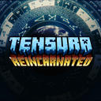
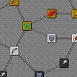
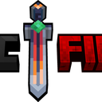

# STAT Mod Wiki

Bienvenue sur le wiki officiel de **STAT Mod**, un système complet de statistiques,
progression, magie et donjon pour Minecraft NeoForge 1.21.1.

**S'intègre avec :**

## Fonctionnalités

- **23 Stats** — 14 stats actives + 8 stats magiques + Forging
- **84 Perks** — 6 perks par stat active avec progression par paliers
- **XP & Leveling** — XP de combat, défense et non-combat avec courbes de progression
- **Trial Dungeon** — donjon procédural infini : 100 thèmes, boss, points, co-op
- **Arbre Magique Unifié** — Intégration Iron's Spellbooks (249 nœuds, 9 écoles)
- **Économie FDP** — monnaie physique, banquier magique, boutique SDM
- **Système Racial** — Intégration Tensura Reincarnated
- **Interface Puffish Skills** — Miroir UI pour perks et arbre magique

## Liens

- [Modrinth](https://modrinth.com/mod/statmod)
- [CurseForge](https://www.curseforge.com/minecraft/mc-mods/stat-mod-rpg)
- [GitHub](https://github.com/eladiouf/MOD_MINECRAFT_STAT)
- [Signaler un bug](https://github.com/eladiouf/MOD_MINECRAFT_STAT/issues)
