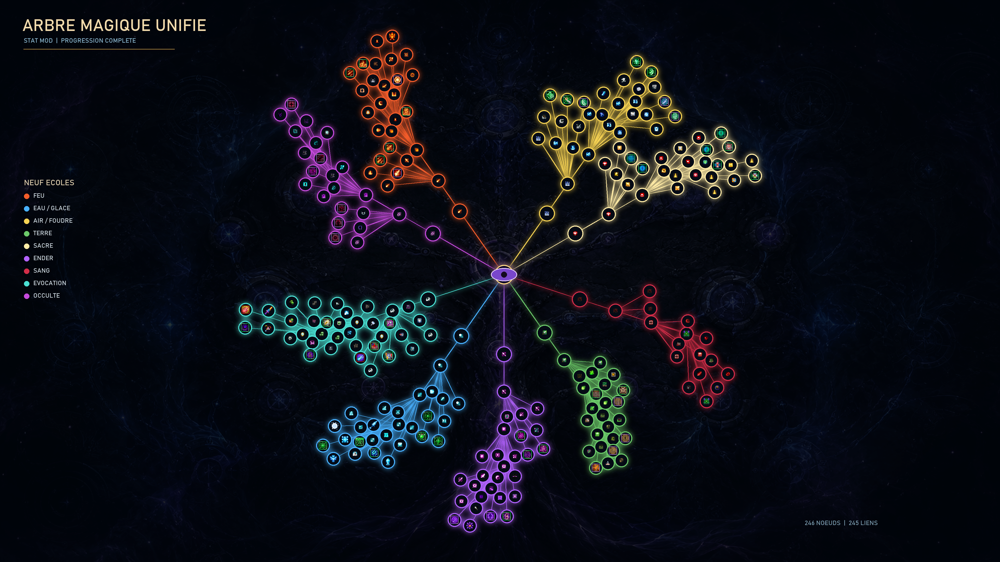
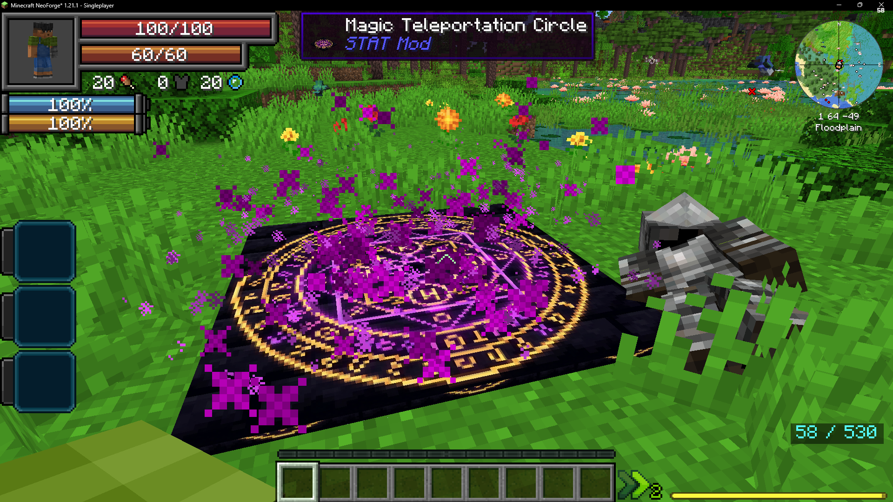

# Arbre Magique Unifié

L'arbre magique unifié intègre **Iron's Spellbooks** dans un système de progression
à **9 écoles**, avec des branches dédiées et des sorts déverrouillables.

Ce rendu est généré directement depuis les **246 nœuds**, les **245 connexions** et
les icônes de sorts réellement livrés avec le modpack.

## Progression

1. Gagner des **points arcanes** en utilisant la magie
2. Dépenser des points pour déverrouiller des nœuds dans l'arbre
3. Chaque école a son propre **compteur de points**
4. Les races Tensura ont des **affinités racales** (réduisent le coût)

## Magie dans le monde

Les déblocages magiques alimentent les sorts, les téléportations et les autres
systèmes arcaniques du modpack.

